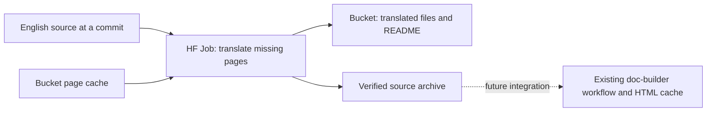

# Preview translated documentation

The translation pipeline reads a specific revision of Transformers' `docs/source/en`, generates Japanese prose with continuous batching on an HF Job, and writes ordinary Markdown files to an HF Bucket. Open the completed run's folder on the Hub to read the results.



This implementation is confined to doc-builder. A two-page Qwen3 preview completed on an HF Job and passed Bucket read-back verification on 2026-09-07. Human review of the Japanese, authenticated Hub viewing, and a full archive/build-cache smoke remain pending before production use.

## Prepare a preview

Use a clean doc-builder checkout containing this implementation, Python 3.12, and Node 22.14.0. Install the runner and the kit's Markdown parser from the repository root:

```bash
uv venv --python 3.12
uv pip install -e . 'huggingface_hub==1.27.0'
npm ci --prefix kit
hf auth login
```

Commit and push the implementation to a reachable doc-builder branch before submitting a Job. The worker fetches your checkout's exact commit from its `origin` repository; it cannot access uncommitted local changes. A token needs access to HF Jobs and the destination Bucket. The translation model is `Qwen/Qwen3-30B-A3B-Instruct-2507`.

Set the source revision to a full Transformers commit SHA. You can validate a clean local Transformers checkout without a GPU or Bucket writes:

```bash
SOURCE_REVISION=$(git -C ../transformers rev-parse HEAD)
.venv/bin/doc-builder translate transformers \
  --source ../transformers --source-revision "$SOURCE_REVISION" --lang ja --dry-run
```

The source checkout is read only. Missing tracked pages, broken symlinks, and sidebar entries without a page fail validation.

## Submit a small translation Job

Create a [Bucket](https://huggingface.co/docs/hub/storage-buckets#creating-a-bucket), then submit a preview with a few relative English page paths. Replace the example namespace and Bucket with yours:

```bash
.venv/bin/python -m doc_builder.translate.job \
  --source-revision "$SOURCE_REVISION" \
  --namespace your-hub-namespace \
  --bucket hf://buckets/your-hub-namespace/docs-translation-preview \
  --pages philosophy.md quicktour.md
```

The command submits an `a100-large` Job, prints its Job URL, and waits for completion. Omit `--pages` to preview the full English source tree. Use `--flavor` to select different hardware. A Job has a five-hour timeout; the runner records its ID in `translation-job.json` for cleanup.

Alternatively, run the manual **Preview translated documentation** workflow in this repository. Supply the Transformers SHA, language, page paths, Bucket, and Job namespace. Configure its `HF_TOKEN` repository secret first. Its summary links to the completed folder and a translated page. This workflow does not upload to the live documentation site.

## Read the results on the Hub

After verification, the runner prints `folder_url` and `page_url`. Open the folder link and choose a translated file under `source/`, or follow a link in the run's README. The [Hub renders directory READMEs below their file lists](https://huggingface.co/docs/hub/storage-buckets#readme-rendering).

Each preview has a unique folder under `previews/transformers/ja/`. It contains readable `.md` and `.mdx` files, supporting assets, `_toctree.yml`, and a `source.tar.gz` archive for build transfer. Reading the files does not require downloading the archive. Doc-builder components may appear as source in the Hub viewer; this is a Markdown preview, not a hosted doc-builder site.

Files can appear while an upload is in progress. The run README is written last, after the uploaded files and archive have been read back and verified. Follow the runner's completed result when selecting a run to inspect.

## Reuse translations and handle failures

The cache stores complete translated pages in one JSON file per package and language. A page's full source and translation configuration determine its cache key. Editing prose, code, URLs, glossary terms, or generation settings invalidates the affected page or configuration. Unchanged validated pages skip inference; the sidebar is cached as one document.

Workers read the shared cache and write a candidate only inside their own run folder. Preview runs leave the shared cache unchanged. They can reuse an existing full-run cache, but preview results do not seed it. A serialized full-run runner updates the shared cache with validated complete pages, including pages completed by a failed Job.

Any required prose unit that remains invalid after one retry fails the update. The retry retains accepted units in memory and generates only the missing units. No successful archive is selected, and there is no English or previous-page fallback. The error identifies the page or sidebar and the failed check. Inspect the Job logs, correct the cause, and start a new run; completed page candidates remain available in the failed run's folder.

To stop a recorded Job manually, run:

```bash
.venv/bin/python -m doc_builder.translate.job --cancel-record translation-job.json
```

The workflow also runs this cleanup after cancellation or failure. The next runner checks for unfinished Jobs with the same translation labels. Late workers can write only their own run files.

## Preserve syntax and terminology

The kit's mdsvex parser supplies prose spans. The model receives complete inline prose containers with XML tags identifying formatting and immutable content. Original immutable content is restored by tag ID. Acceptance checks preserve token identity, nesting, document structure, and glossary renderings; empty responses and whole-unit English echoes fail. These checks do not establish translation quality: the live preview still contains some untranslated phrases inside otherwise Japanese paragraphs.

The adapter preserves rendered structure through a few source normalizations: explicit original heading anchors, explicit targets for shortcut reference links, and escapes for literal Markdown delimiters that Japanese punctuation could turn into formatting. Bare URLs become explicit autolinks so adjacent Japanese particles cannot enter the URL. Headings whose IDs come from `[[autodoc]]` retain that behavior.

Edit `src/doc_builder/glossaries/ja.yml` to keep product names unchanged or require specific Japanese terms. Adding a language also requires a language mapping, glossary, and disclosure text. Autodoc-generated Python docstrings remain English; the pipeline translates checked-in prose and navigation titles.

## Prepare the later build integration

Full runs use the runner's `--full` flag from a GitHub Actions caller that serializes submission through building for the package, language, and Bucket. They write under `runs/transformers/ja/` and may update the shared cache. The current manual preview workflow deliberately does not enable this mode.

The existing shared build workflow accepts `translation_archive`, `translation_archive_sha256`, `translation_language`, and `doc_builder_revision`, together with its existing source `commit_sha`. Set `languages` to that single language. The consumer checks the archive's identity and complete file inventory before replacing the language folder in its disposable checkout. Its normal build retains the HTML page cache from [PR #800](https://github.com/huggingface/doc-builder/pull/800).

Before enabling a Transformers caller, run a real GPU preview, inspect its Hub links, build a full accepted archive, and verify a warm translation/build-cache run. Coordinate ownership of Japanese docs and the legacy producer at that later cutover.

## Next steps

The worker pins [PyTorch 2.8.0 with CUDA 12.8](https://hub.docker.com/layers/pytorch/pytorch/2.8.0-cuda12.8-cudnn9-runtime/images/sha256%3A417bd75df6365104c283ea4c1651fb3530d9eb5a4c2fafa51943cff2a94e6385) by image digest, Node 22.14.0, Hub SDK 1.27.0, and a specific Transformers implementation revision in `src/doc_builder/translate/pipeline.py`. Model and tokenizer revisions are resolved once by the runner and passed to the worker. This runtime completed the two-page preview with Qwen3 on an A100; the full-source and warm-cache runs still need verification.

See the [continuous batching guide](https://huggingface.co/docs/transformers/main/continuous_batching) for generation behavior and the [implementation plan](../plans/001-simplify-translation.md) for the review regression matrix and remaining live checks.
